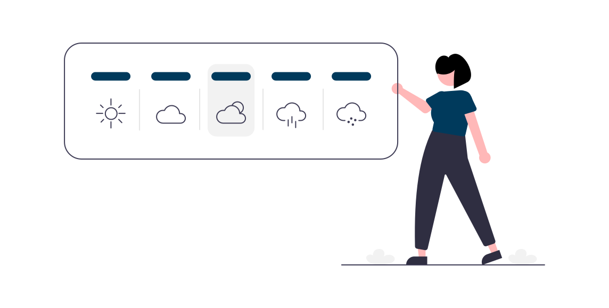

## Table of contents

- [General info](#general-info)
- [Technologies](#technologies)
- [Setup](#setup)
<p align="right">
  
</p>

## General info

Este proyecto cumple la función de, mediante una barra de busqueda, consultar a una API externa (https://openweathermap.org/api).
Y renderizar una card, con la siguiente información:

- Nombre de la ciudad
- Temperatura máxima esperada
- Temperatura mínima esperada
- Humedad en el aire
- Mediante un icono indica la condición del cielo (despejado, nublado, tormentas electricas)

## Technologies

Para este proyecto usé:

- Vite
- React, con Javascript
- Redux
- CSS
- axios, para la comunicacion con la API
- Vercel, para el deploy

## Setup

Para correr este proyecto localmente:

```
$ cd Weather-App
$ npm install
$ npm run dev
```
